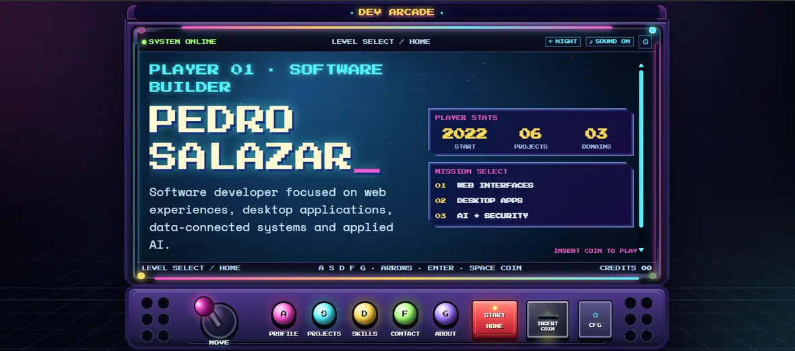
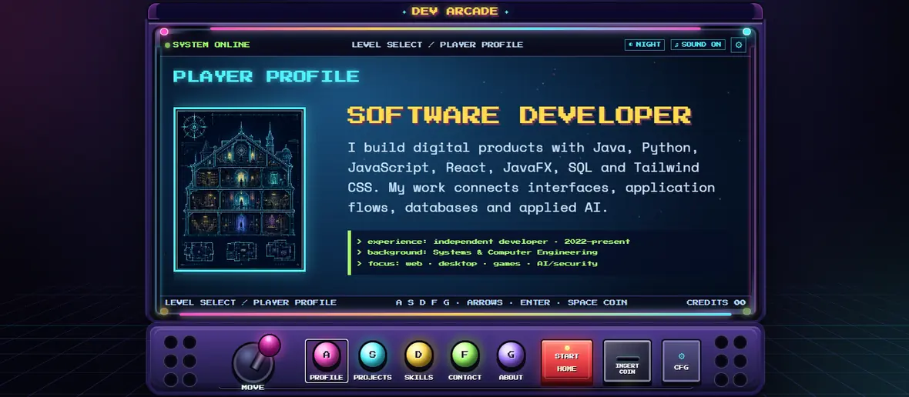
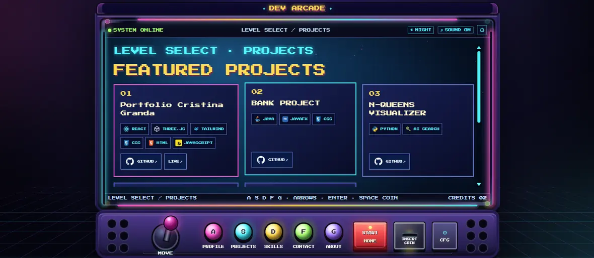
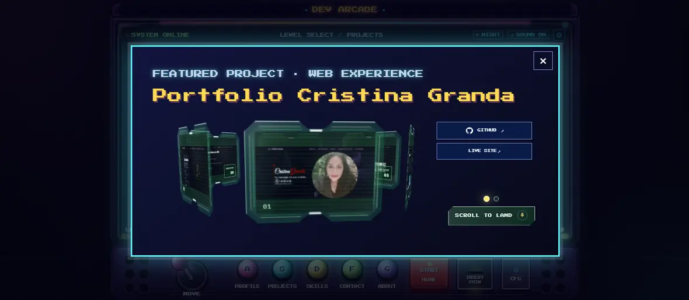
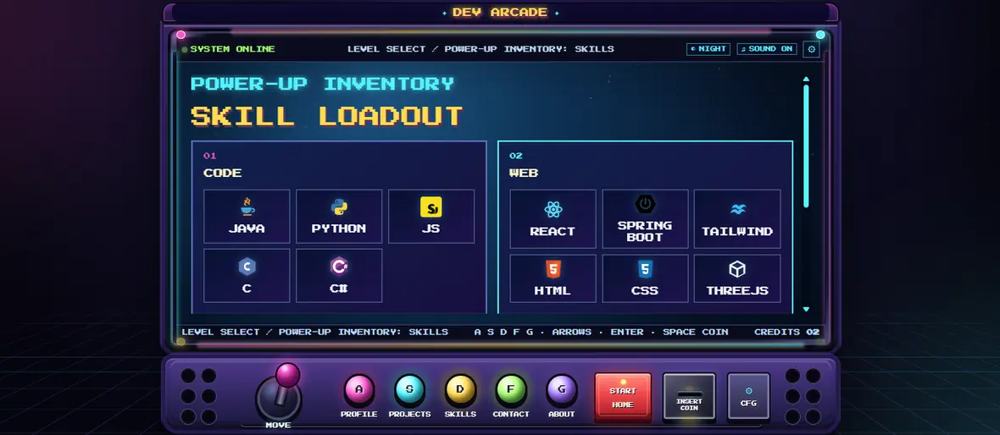
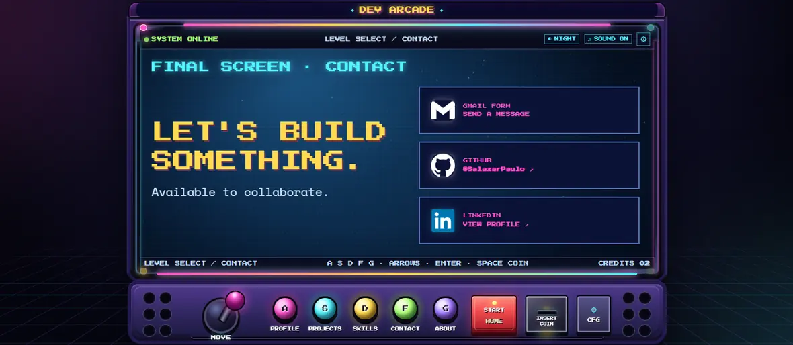
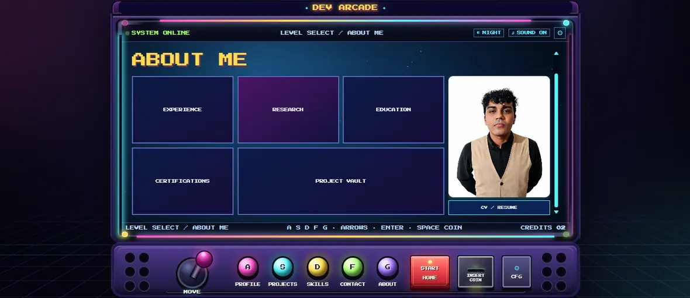
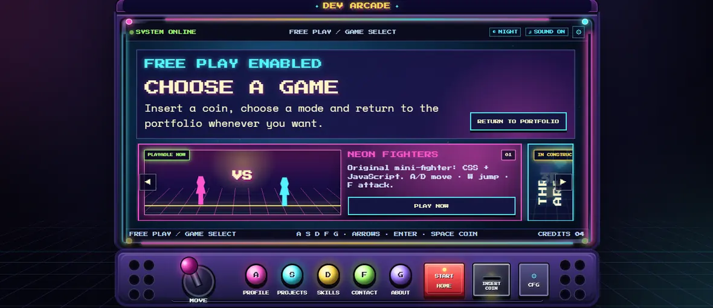

# 🕹️ DEV ARCADE · Portafolio interactivo


**DEV ARCADE** es un portafolio web estático con estética de máquina arcade y pantalla CRT. Presenta perfil profesional, proyectos, habilidades, contacto, CV, configuración visual, audio interactivo y un minijuego jugable, usando HTML, CSS y JavaScript nativo.

🌐 **Sitio publicado:** <https://salazarpaulo.github.io/>

---

## Vista previa

| Home | Perfil |
|---|---|
|  |  |

| Proyectos | Modal de proyecto |
|---|---|
|  |  |

| Skills | Contacto |
|---|---|
|  |  |

| About me | Free play |
|---|---|
|  |  |

---

## Características principales

- Interfaz arcade responsive con marco de cabina, CRT, panel inferior, joystick, botones y efectos visuales.
- Navegación interna por pantallas: Home, Profile, Projects, Skills, Contact, About, Free Play y Config.
- Modal de proyectos con carrusel, texto descriptivo, enlaces, video local y transición por fases.
- Tema claro/oscuro, sonido, escalas visuales y preferencias persistidas en `localStorage`.
- Textos localizados en inglés y español.
- Fuentes locales en `assets/fonts`, sin depender de Google Fonts en tiempo de ejecución.
- CV en español e inglés dentro de `assets/documents`.
- Formulario de contacto con EmailJS cargado bajo demanda.
- Minijuego **Neon Fighters** construido con Canvas, Web Audio API y JavaScript nativo.

---

## Tecnologías

| Área | Uso |
|---|---|
| HTML5 | Estructura semántica, pantallas, diálogos y controles accesibles. |
| CSS3 | Layout arcade, temas, animaciones, responsive y efectos CRT. |
| JavaScript | Navegación, estado, modales, audio, minijuego, preferencias y eventos. |
| Canvas 2D | Renderizado del fondo visual y lógica del minijuego. |
| Web Audio API | Efectos de sonido y audio generado en navegador. |
| EmailJS | Envío de mensajes desde el formulario de contacto sin backend propio. |
| pnpm | Instalación y ejecución de scripts de desarrollo. |
| esbuild / Lightning CSS / Prettier | Minificación y validación opcional de archivos fuente. |
| GitHub Pages | Publicación estática desde el repositorio. |

---

## Paradigma, patrones y arquitectura

| Aspecto | Aplicación en el proyecto |
|---|---|
| Paradigma principal | Programación orientada a eventos: la experiencia responde a clics, teclado, controles arcade, cambios de tema, audio, modales y navegación interna. |
| Paradigma complementario | Programación estructurada y modular: el código está separado por responsabilidades, configuración, estado, navegación, audio, formulario, minijuego y modal de proyectos. |
| Renderizado guiado por datos | Las cards de proyectos, tecnologías, textos localizados y estados del modal se alimentan desde objetos de configuración en JavaScript. |
| Patrón de controlador de interfaz | `script.js` centraliza navegación, estado visual, preferencias y eventos principales del portafolio. |
| Patrón de modal especializado | `project-modal.js` aísla la lógica del modal de proyectos, su carrusel, fases, video y transiciones. |
| Lazy loading | EmailJS se carga bajo demanda, solo cuando el flujo de contacto lo necesita. |
| Arquitectura | Aplicación web estática tipo SPA del lado del cliente, organizada en capas: HTML semántico, CSS visual/responsive, JavaScript de comportamiento y assets locales. |

El proyecto no usa framework ni backend propio; la publicación se realiza como sitio estático en GitHub Pages, con build opcional para generar archivos minificados.

---

## Estructura del proyecto

```text
.
├── index.html
├── styles.css
├── styles.min.css
├── project-modal.css
├── script.js
├── script.min.js
├── project-modal.js
├── package.json
├── pnpm-lock.yaml
├── README.md
├── ARCHITECTURE.md
├── BUILD.md
├── PERFORMANCE_NOTES.md
├── REFACTOR_AUDIT.md
├── THIRD_PARTY_NOTICES.md
├── SHA256SUMS.txt
├── .nojekyll
└── assets/
    ├── documents/
    ├── fonts/
    ├── icons/
    ├── images/
    ├── projects/
    ├── readme/screenshots/
    ├── skills/
    └── tech/
```

---

## Arquitectura resumida

El proyecto es una aplicación estática del lado del cliente. `index.html` contiene las pantallas y diálogos; `styles.css` define la interfaz arcade, los temas y el responsive; `script.js` controla navegación, preferencias, audio, juego y formularios; `project-modal.js` maneja el modal avanzado de proyectos; y `assets/` agrupa fuentes, imágenes, videos, documentos, iconos y capturas del README.

Para una descripción más detallada, revisa [`ARCHITECTURE.md`](./ARCHITECTURE.md).

---

## Trabajo local

Instala dependencias con pnpm:

```bash
pnpm install --frozen-lockfile
```

Valida los archivos fuente:

```bash
pnpm run check
```

Regenera los archivos minificados:

```bash
pnpm run build
```

Los archivos legibles son `styles.css`, `script.js` y `project-modal.js`. Los archivos `styles.min.css` y `script.min.js` son las versiones optimizadas usadas por `index.html`.

---

## Publicación en GitHub Pages

El sitio está preparado para publicarse desde la raíz de la rama `main` en GitHub Pages. La carpeta `.nojekyll` se conserva para evitar que GitHub Pages procese los assets como un sitio Jekyll.

Flujo de publicación recomendado:

```bash
git add -A
git commit -m "Update portfolio"
git push origin main
```

---

## Notas de mantenimiento para mi

- Mantén los assets locales dentro de `assets/` para evitar dependencias remotas innecesarias.
- Si cambias `styles.css` o `script.js`, vuelve a ejecutar `pnpm run build`.
- Si agregas o reemplazas capturas del README, usa imágenes WebP livianas dentro de `assets/readme/screenshots/`.
- Después de cambios de contenido, regenera `SHA256SUMS.txt` si quieres conservar la verificación de integridad del paquete.

---

## 👨‍💻 Autor

**Pedro Salazar**

Portafolio orientado a desarrollo de software, interfaces, inteligencia artificial y proyectos interactivos.

---

## 📄 Uso

Proyecto de portafolio personal. Libre de reutilizar código, recursos visuales, sin utilizar documentos o contenido profesional.
